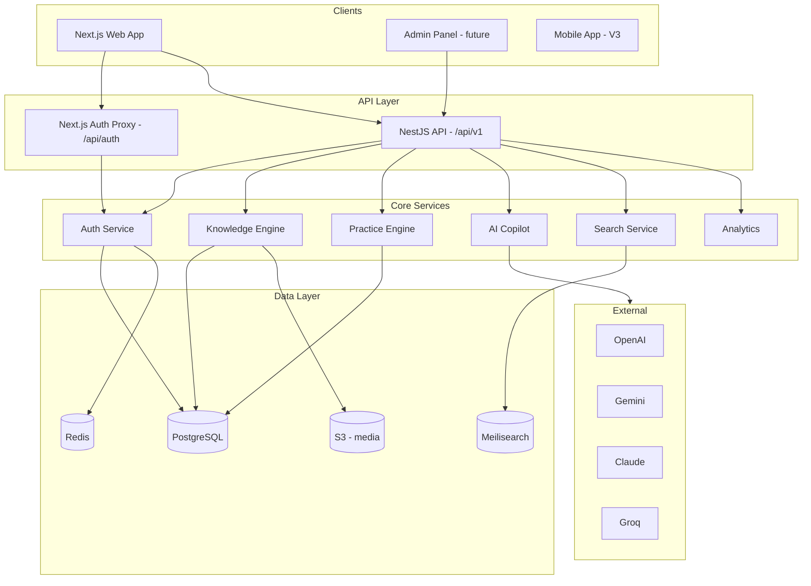
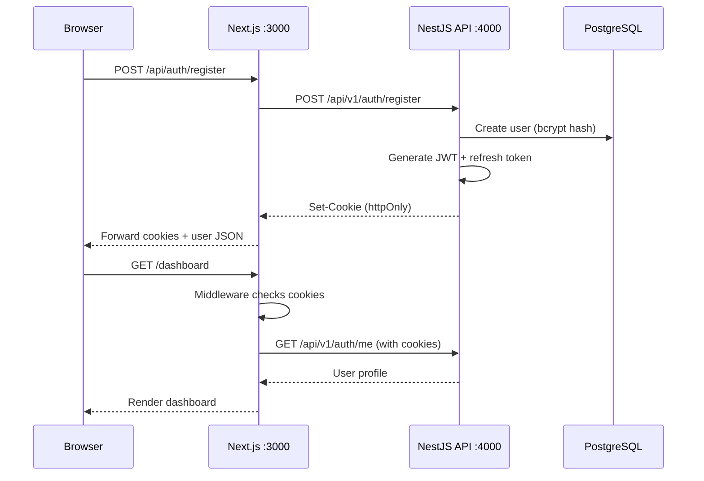

# DataArena — Architecture & Product Blueprint

> **Purpose:** The single reference for how DataArena is designed — technically, functionally, and as a product.  
> **Audience:** Developers, product owners, and future contributors.  
> **Last updated:** Version 0.4 (March 2026)

---

## 1. Product Vision

**DataArena** is the operating system for Data Engineers — a unified platform where learning, practice, interview prep, career growth, and AI assistance live in one ecosystem instead of across fragmented tools.

### Problem we solve

| Today (fragmented) | DataArena (unified) |
|------------------|---------------------|
| Notes on random blogs | Structured learning hubs |
| SQL on LeetCode | SQL + context from notes |
| PySpark tutorials elsewhere | Integrated practice with explanations |
| Interview Q&A on another site | Topic-linked interview prep |
| AI in a separate ChatGPT tab | Contextual AI on every page |

### Core principles

1. **Learn** — Structured notes and deep dives
2. **Practice** — SQL, Python, PySpark hands-on labs
3. **Build** — Real-world data engineering projects
4. **Revise** — Flashcards and quick revision tools
5. **Interview** — Mock interviews and company-specific Q&A
6. **Create** — Portfolio, LinkedIn content, resume tools
7. **Grow** — AI-assisted continuous career development

### Success metrics

- High learner retention (weekly active users, session duration)
- Complete topic coverage across the data engineering spectrum
- AI-assisted learning adoption rate
- Search-first discovery (time to find content)
- Modular, maintainable architecture (developer velocity)

---

## 2. User Personas

### Primary: Aspiring Data Engineer
- Learning SQL, Python, Spark from scratch
- Needs structured paths and practice
- Preparing for first DE role

### Secondary: Working Data Engineer
- Upskilling (cloud, streaming, orchestration)
- Interview prep for better roles
- Quick reference and revision

### Tertiary: Platform Admin / Content Creator
- Manages categories, topics, articles
- Publishes and curates content
- Views analytics on content performance

### Future: Team Lead / Company
- Team workspaces and learning paths
- Company-specific interview prep
- Team progress dashboards

---

## 3. System Architecture (High Level)



---

## 4. Repository Structure

### Current (v0.4)

```
dataArena/
├── apps/
│   ├── web/                    # Next.js frontend (port 3000)
│   └── api/                    # NestJS backend (port 4000)
├── docs/                       # All documentation
├── docker-compose.yml          # PostgreSQL + Redis
├── package.json                # Monorepo root
└── README.md                   # Quick start guide
```

### Target (full monorepo)

```
dataArena/
├── apps/
│   ├── web/                    # Public-facing Next.js app
│   ├── api/                    # NestJS REST API
│   └── admin/                  # Admin CMS (Next.js or separate)
├── packages/
│   ├── ui/                     # Shared UI components
│   ├── database/               # Prisma schema + client
│   ├── ai/                     # AI provider abstraction
│   ├── auth/                   # Shared auth types/utils
│   └── shared/                 # Shared types, constants, utils
├── content/                    # Markdown content (git-based CMS)
├── infrastructure/             # Terraform, K8s, CI/CD
├── docker/                     # Dockerfiles
└── docs/                       # Documentation
```

---

## 5. Technology Stack

### Frontend (`apps/web`)
| Technology | Purpose | Status |
|------------|---------|--------|
| Next.js 16 | App framework, SSR, routing | Active |
| React 19 | UI library | Active |
| TypeScript | Type safety | Active |
| Tailwind CSS v4 | Styling | Active |
| shadcn/ui | Component library | Active |
| Framer Motion | Animations | Active |
| React Hook Form | Form handling | Active |
| Zod | Client validation | Active |
| TanStack Query | Server state (planned) | Planned |

### Backend (`apps/api`)
| Technology | Purpose | Status |
|------------|---------|--------|
| NestJS 11 | API framework | Active |
| Prisma 7 | ORM + migrations | Active |
| PostgreSQL 16 | Primary database | Active |
| Redis 7 | Cache, rate limits, sessions | Docker ready |
| BullMQ | Background jobs | Planned |
| Passport + JWT | Authentication | Active |
| class-validator | Request validation | Active |
| Helmet | Security headers | Active |

### AI (planned)
| Provider | Use case |
|----------|----------|
| OpenAI | Primary (GPT-4o) |
| Google Gemini | Cost-effective alternative |
| Anthropic Claude | Long-context explanations |
| Groq | Fast inference for practice |
| DeepSeek | Budget option |
| OpenRouter | Multi-model gateway |

All providers behind a single **AI abstraction layer** in `packages/ai`.

### Infrastructure
| Service | Purpose | Phase |
|---------|---------|-------|
| Docker Compose | Local dev (Postgres, Redis) | Active |
| Vercel | Frontend hosting | Planned |
| Railway | API + DB hosting (initial) | Planned |
| AWS | Production scale | Future |
| Cloudflare | CDN, DDoS protection | Future |
| Amazon S3 | Media/file storage | Planned |
| GitHub Actions | CI/CD | Planned |
| Meilisearch | Full-text search | Planned |

---

## 6. Major Product Modules

### 6.1 Knowledge Engine
**Purpose:** Structured learning content — the core of DataArena.

**Entities:**
- Category (e.g., "Databases", "Streaming", "Cloud")
- Topic (e.g., "Apache Kafka", "Delta Lake")
- Article (markdown content with sections)
- Tag (cross-cutting labels)

**Each Learning Hub contains:**
- Rich markdown notes with syntax highlighting
- Diagrams (Mermaid, images)
- Code snippets (runnable where possible)
- Related topics graph
- Interview questions linked to topic
- AI chat contextual to the page

**User flows:**
1. Browse categories → pick topic → read article
2. Search → land on article
3. Bookmark article for later
4. Track reading progress (% complete)

### 6.2 Practice Engine
**Purpose:** Hands-on coding practice for data engineering skills.

**Sub-modules:**
| Module | Description |
|--------|-------------|
| SQL Lab | Write and run SQL against sample datasets |
| Python DE | Pandas, PySpark basics, data pipeline scripts |
| PySpark Lab | RDD, DataFrame, streaming exercises |
| System Design | Architecture diagram challenges (V2) |

**Features:**
- Problem statement + expected output
- Code editor with syntax highlighting
- Run code in sandboxed environment
- AI debug assistant for failed submissions
- Difficulty levels: Easy, Medium, Hard
- Company-tagged problems (future)

### 6.3 AI Copilot
**Purpose:** Contextual AI assistant on every page.

**Capabilities:**
- Explain selected paragraph
- Explain code block
- Generate quiz from content
- Summarize article
- Create revision notes
- Generate interview questions
- Debug SQL/Python/PySpark code
- Produce LinkedIn posts from learnings

**Architecture:**
```
User action → Context builder (page content + selection)
           → AI provider abstraction (packages/ai)
           → Selected provider (OpenAI/Gemini/etc.)
           → Streamed response to UI side panel
```

**Future:**
- RAG over all DataArena content (vector search)
- Personalized recommendations based on progress
- AI mentor with memory across sessions

### 6.4 Interview Hub (V2)
- Company-specific question banks
- Mock interview sessions (timed)
- System design whiteboard
- Behavioral question prep
- Answer evaluation with AI feedback

### 6.5 Career Hub (V2)
- LinkedIn post generator from learnings
- Resume review with AI
- Learning path recommendations
- Job readiness score

### 6.6 Analytics
- User progress dashboards
- Content engagement metrics (admin)
- Learning streaks and milestones
- Time spent per topic

### 6.7 Community (V2)
- Discussion threads per topic
- User-submitted solutions
- Study groups
- Leaderboards

### 6.8 Admin CMS
- Category/topic/article CRUD
- Markdown editor with preview
- Media upload to S3
- Publishing workflow (draft → review → published)
- SEO metadata management
- Content analytics dashboard

---

## 7. Database Design

### Implemented (v0.3)

```prisma
User {
  id, email, passwordHash, name, role, emailVerified
  createdAt, updatedAt
}

RefreshToken {
  id, userId, tokenHash, expiresAt, revokedAt, createdAt
}
```

### Planned (full schema)

```prisma
Category { id, name, slug, description, order, icon }
Topic { id, categoryId, name, slug, description, difficulty, order }
Article { id, topicId, title, slug, content, status, publishedAt }
Section { id, articleId, title, content, order }
Tag { id, name, slug }
TopicTag { topicId, tagId }

Question { id, topicId, type, difficulty, title, content, solution }
Submission { id, userId, questionId, code, status, runtime }

Bookmark { id, userId, topicId | articleId, createdAt }
Progress { id, userId, topicId, percentComplete, lastReadAt }

AIConversation { id, userId, contextType, contextId, messages }
Flashcard { id, userId, topicId, front, back, nextReviewAt }

Notification { id, userId, type, content, readAt }
Subscription { id, userId, plan, status, expiresAt }
```

---

## 8. Authentication Architecture

### Current flow (v0.3)



### Token strategy
| Token | Lifetime | Storage | Purpose |
|-------|----------|---------|---------|
| Access (JWT) | 15 minutes | httpOnly cookie | API authorization |
| Refresh | 7 days | httpOnly cookie | Obtain new access token |

### Security layers
1. bcrypt password hashing (12 rounds)
2. JWT signed with separate secrets (access vs refresh)
3. Refresh token rotation (one-time use)
4. Rate limiting (5 register/min, 10 login/min per IP)
5. Helmet HTTP security headers
6. CORS whitelist (frontend origin only)
7. Input validation (whitelist + transform)
8. Role-based access control (USER, ADMIN)

### Future auth enhancements
- Email verification flow
- Password reset via email
- Google + GitHub OAuth
- Two-factor authentication (2FA)
- Session management page (view/revoke active sessions)
- Account lockout after N failed attempts

---

## 9. API Design

### Versioning
All endpoints prefixed with `/api/v1/`.

### Conventions
- RESTful resource naming
- JSON request/response bodies
- Standard error format: `{ statusCode, message, error }`
- Pagination: `?page=1&limit=20`
- Filtering: `?category=sql&difficulty=easy`

### Endpoint map (current + planned)

#### Auth (implemented)
```
POST   /api/v1/auth/register
POST   /api/v1/auth/login
POST   /api/v1/auth/logout
POST   /api/v1/auth/refresh
GET    /api/v1/auth/me
```

#### Knowledge (planned)
```
GET    /api/v1/categories
GET    /api/v1/categories/:slug/topics
GET    /api/v1/topics/:slug
GET    /api/v1/articles/:slug
POST   /api/v1/articles          (admin)
PUT    /api/v1/articles/:id      (admin)
DELETE /api/v1/articles/:id      (admin)
```

#### Practice (planned)
```
GET    /api/v1/questions
GET    /api/v1/questions/:id
POST   /api/v1/questions/:id/submit
GET    /api/v1/submissions
```

#### Search (planned)
```
GET    /api/v1/search?q=kafka&type=article
```

#### AI (planned)
```
POST   /api/v1/ai/chat
POST   /api/v1/ai/explain
POST   /api/v1/ai/quiz
```

#### User (planned)
```
GET    /api/v1/bookmarks
POST   /api/v1/bookmarks
DELETE /api/v1/bookmarks/:id
GET    /api/v1/progress
PUT    /api/v1/progress/:topicId
```

---

## 10. Frontend Architecture

### Route structure

```
/                           Landing page (public)
/login                      Login form (public, redirect if authed)
/register                   Register form (public, redirect if authed)
/dashboard                  User dashboard (protected)
/notes                      Topic browser (protected, planned)
/notes/[category]           Category page (planned)
/notes/[category]/[topic]   Article reader (planned)
/practice                   Practice hub (planned)
/practice/sql               SQL lab (planned)
/practice/python            Python exercises (planned)
/practice/pyspark            PySpark exercises (planned)
/search                     Search results (planned)
/settings                   User settings (planned)
/admin                      Admin CMS (admin only, planned)
```

### Key patterns
- **Server Components** for data fetching (dashboard, article pages)
- **Client Components** for interactivity (forms, editor, AI panel)
- **Middleware** for route protection
- **API proxy routes** for auth cookie handling
- **TanStack Query** for client-side data caching (planned)

### Auth proxy pattern
Because frontend (:3000) and API (:4000) run on different ports locally, auth cookies are proxied through Next.js:

```
Browser → /api/auth/login → Next.js route handler → NestJS :4000
                                                ← Set-Cookie forwarded
```

In production, both can share a domain (e.g., `dataarena.com` + `api.dataarena.com`) with proper cookie domain config.

---

## 11. Search Architecture (planned)

### Phase 1: Meilisearch
- Index: articles, topics, questions, interview Q&A
- Unified search bar in navbar
- Filters: type, category, difficulty
- Instant results with highlighting

### Phase 2: OpenSearch / Elasticsearch
- Scale to millions of documents
- Faceted search, aggregations
- Search analytics

### Indexing flow
```
Content created/updated → BullMQ job → Index in Meilisearch
                                     → Update search suggestions
```

---

## 12. AI Architecture (planned)

### Provider abstraction (`packages/ai`)

```typescript
interface AIProvider {
  chat(messages: Message[], options?: ChatOptions): AsyncIterable<string>
  complete(prompt: string, options?: CompleteOptions): Promise<string>
}

// Implementations: OpenAIProvider, GeminiProvider, ClaudeProvider, etc.
```

### Context builder
Each page provides context to the AI:
- Article content (for explain/summarize)
- Code selection (for debug/explain)
- User progress (for personalized recommendations)

### RAG pipeline (future)
```
User query → Embed query → Vector search (pgvector/Pinecone)
          → Retrieve top-k relevant chunks
          → Build prompt with context
          → LLM generates answer with citations
```

---

## 13. Deployment Architecture

### Development
```
localhost:3000  → Next.js dev server
localhost:4000  → NestJS dev server
localhost:5432  → PostgreSQL (Docker)
localhost:6379  → Redis (Docker)
```

### Staging / Production (planned)
```
dataarena.com          → Vercel (Next.js frontend)
api.dataarena.com      → Railway (NestJS API)
db.railway.app         → Railway PostgreSQL
redis.railway.app      → Railway Redis
search.dataarena.com   → Meilisearch (Railway or self-hosted)
media.dataarena.com    → Cloudflare R2 / S3
```

### CI/CD (planned)
```
Push to main → GitHub Actions
  ├── Lint + type check
  ├── Unit tests
  ├── Build frontend + API
  ├── Run Prisma migrations
  ├── Deploy frontend to Vercel
  └── Deploy API to Railway
```

---

## 14. Release Roadmap

### Phase 1 — Foundation (current)
- [x] Landing page
- [x] Authentication
- [ ] Notes & topics
- [ ] Search

### Phase 2 — Engagement
- [ ] AI Copilot (side panel)
- [ ] Bookmarks
- [ ] Progress tracking

### Phase 3 — Practice
- [ ] SQL practice engine
- [ ] Python for Data Engineers
- [ ] PySpark practice

### Phase 4 — Interview & Career
- [ ] Interview Hub
- [ ] System design challenges
- [ ] Mock interviews

### Phase 5 — Community
- [ ] Discussion forums
- [ ] User submissions
- [ ] Leaderboards

### Phase 6 — Monetization
- [ ] Premium subscriptions
- [ ] Team workspaces
- [ ] Company dashboards

### V3 — Scale
- [ ] Mobile app (React Native)
- [ ] Personalized AI mentor
- [ ] Enterprise features

---

## 15. Engineering Principles

1. **Clean Architecture** — Separation of concerns (controllers → services → repositories)
2. **SOLID** — Single responsibility, dependency injection via NestJS
3. **Modular Monorepo** — Shared packages, independent deployable apps
4. **Feature-first organization** — Group by domain, not by layer
5. **API versioning** — `/api/v1/` prefix, breaking changes → v2
6. **Test critical paths** — Auth, payments, code execution sandbox
7. **Observability** — Structured logging, error tracking (Sentry), metrics
8. **Markdown-first content** — Content in git + DB, render everywhere
9. **AI provider abstraction** — Swap LLM providers without code changes
10. **Security by default** — Validate everything, least privilege, secure cookies

---

## 16. Non-Functional Requirements

| Requirement | Target |
|-------------|--------|
| Page load time | < 2s (LCP) |
| API response time | < 200ms (p95) |
| Uptime | 99.9% |
| Database backups | Daily automated |
| Auth token security | httpOnly, secure, sameSite |
| Code sandbox isolation | Containerized execution |
| Content delivery | CDN for static assets |
| Search latency | < 100ms (Meilisearch) |
| AI response start | < 2s (streaming) |

---

## 17. Decision Log

| Date | Decision | Rationale |
|------|----------|-----------|
| Mar 2026 | NestJS over Next.js API routes | Matches product doc, better for complex backend, separate scaling |
| Mar 2026 | Custom auth over Clerk/Auth.js | Full control, no vendor lock-in, needed for admin roles |
| Mar 2026 | httpOnly cookies over localStorage | XSS protection, standard for session tokens |
| Mar 2026 | Next.js auth proxy for local dev | Solves cross-port cookie issue (3000 vs 4000) |
| Mar 2026 | Prisma over TypeORM | Better DX, type-safe queries, migration tooling |
| Mar 2026 | First user = ADMIN | Simple bootstrap without seed scripts |
| Mar 2026 | Meilisearch over Elasticsearch | Simpler setup, fast enough for V1 scale |
| Mar 2026 | Monorepo with npm workspaces | Shared types/packages, single repo management |

---

*This document evolves with the project. See [DEVELOPMENT_LOG.md](./DEVELOPMENT_LOG.md) for versioned build history.*
